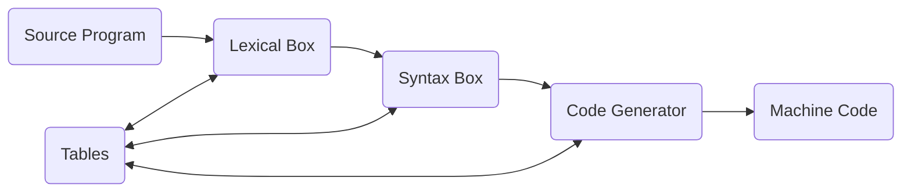

### 1.2 A Naive Compiler Model

The process of transforming the written patterns of a programming language into the machine code representation is fairly complex to try and think of a "compiler" as a single boxed program, therefore its easier to think of it as split into multiple smaller parts that all work together.

A naive approach to this separation of the tasks of a compiler can lead us to the image of 3 boxes, the *lexical box*, the *syntax box*, and the *code generator*, that work in a serial connection to process the source program into machine code. Each of these boxes also has access to a 4th box, containing tables of data relating to the process of compilation, for example there may be a *symbol table* which holds the information about each variable or identifier that is within your source program. 

#### **Lexical Box**

The lexical box gets the bit patterns representing the strings that make up the source program.*** Its job is to separate those bits into the individual words that they represent.***

Here is an example of an input line that we could take into the Lexical Box:
$$\text{IFB1=13GOTO4}$$

The lexical box would take this input line and discern the different distinct strings within them that pertain to our source language, in this case it would tell you that the string contains the substrings, IF, B1, =, 13, GOTO, and 4. These strings are commonly called *tokens*

Each *token* contains two parts, a class part and a value part. For example the **B1** token may be of class "variable" and might contain the value which is the pointer to the symbol table entry for B1

We can equate the process that the Lexical Box does on our input as collecting the individual letters in the string into words and then finding the meaning of those words in the dictionary; the dictionary being the symbol table in our case.

#### **Syntax Box**

**The Syntax Box's job is to take the tokens and their order from the Lexical Box and transform them into an order that represents the order in which the programmer intends the operations to be carried out.**

Lets take the input:

$$\text{A + B * C}$$

The Syntax Box will take these 5 tokens and transform them into new entities, called *atoms*, which represent better the order in which we want the operations to happen, based on **syntactical rules**.

Output: 

$$\text{MULT(B, C, R1) ADD(A, R1, R2)}$$
 
 We see that we now have a different order of operations than the input, where the multiplication happens first and the addition happens afterwards.
 
 *Atoms*, like tokens, have a class and value part to them. Taking the MULT atom above, it might be of class "MULT" and have the value consisting of the three pointers to B, C, and R1. Within the compiler the atom would be represented by an integer representing the MULT class and the three pointers representing the value part.
 
 The syntactical rules alluded to above can be seen as analogous to the grammar associated with a natural language, like English, and the transformation from the Lexical Box output to the Syntax Box output can be seen as a translation between two natural languages, like English to German.
 
 
 #### **Code Generator**
 
 The code generators job is the take the atoms from the Syntax Box and expand them into machine operations that will carry out the same intent as the atoms. This expansion may change depending on certain conditions, for example, the current state of the run time, the table values being accessed in the atoms, the state of the registers, etc. 
 
 Take MULT(B, C, R1), if B is a floating point number then the code generator must expand the atom using floating point operations, or if B and C are different types, then it may expand the atom with type-conversion operations, etc.
 
 Sometimes producing efficient machine code may need an in-depth analysis of the current registers contents. This can be effective but good register management depends largely on the system you are compiling on.
 
 Compiler subactivites which concern themselves with the "meaning" of the symbols is called *semantic processing*, for example type definitions and array dimensions. Sometimes this semantic processing is carried out within a separate box between the Syntax Box and the Code Generator. 
 
 Some subactivites which are solely created to produce more efficient code, not necessarily needed to make functioning code, can be called *optimizations*.
 
 [[1.1 Language Processors|<Prev]] | [[1.3 Passes And Boxes|Next>]]